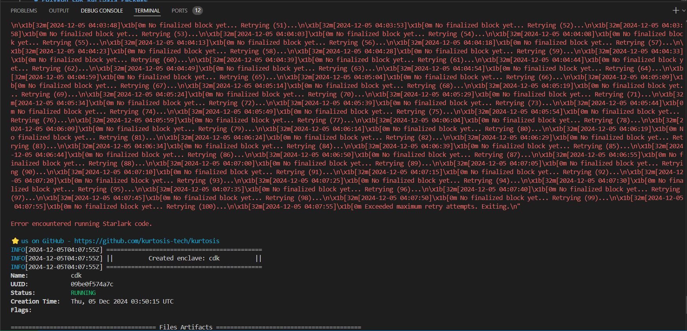

## Dependencies installed

Docker engine   
Kurtosis cli   
Foundry   
yq   
jq   
polygon-cli   

## Steps to run kurtosis CDK

```kurtosis run --enclave cdk . ```

### Error
Deploying zkevm contracts on L1
-------------------------------
There was an error executing Starlark code 
An error occurred executing instruction (number 43) at github.com/0xPolygon/kurtosis-cdk/deploy_zkevm_contracts.star[108:14]:
  exec(service_name="contracts-001", recipe=ExecRecipe(command=["/bin/sh", "-c", "chmod +x /opt/contract-deploy/run-contract-setup.sh && /opt/contract-deploy/run-contract-setup.sh"]), description="Deploying zkevm contracts on L1")

Error encountered running Starlark code.


