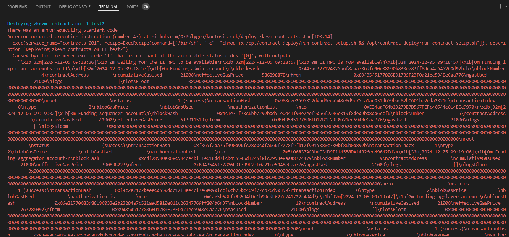
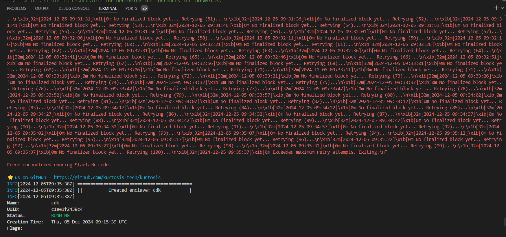

## waiting for finalized block

command to execute
-------------------
```kurtosis run --enclave cdk-v1 . ```

Code
-----

``./templates/contrats-deploy/run-contract-setup.sh``

``` 
l1_preset="{{.l1_preset}}"
if [[ $l1_preset == "minimal" ]]; then
    wait_for_finalized_block;
fi
```

```
wait_for_finalized_block() {
    counter=0
    max_retries=100
    until cast block --rpc-url "{{.l1_rpc_url}}" finalized &> /dev/null; do
        ((counter++))
        echo_ts "No finalized block yet... Retrying ($counter)..."
        if [[ $counter -ge $max_retries ]]; then
            echo_ts "Exceeded maximum retry attempts. Exiting."
            exit 1
        fi
        sleep 5
    done
}
```

Error
-------





